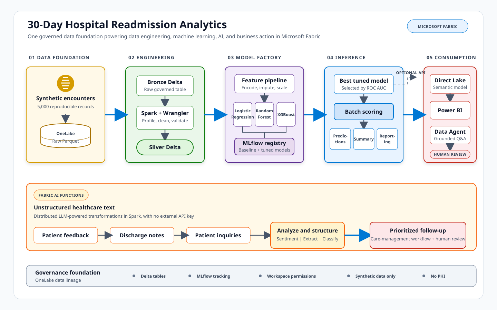

# Predicting 30-Day Hospital Readmission in Microsoft Fabric

This workspace contains a 45-minute, end-to-end Microsoft Fabric demonstration that predicts 30-day hospital readmission risk from synthetic patient encounters.

The notebook shows how one governed copy of data in OneLake can support Spark data engineering, exploratory analysis, machine learning, MLflow model management, batch scoring, Direct Lake reporting, Fabric AI Functions, and a grounded Fabric Data Agent.

> **Important:** All data is synthetic. The notebook contains no PHI or real patient records. Model output is intended only for workflow prioritization and demonstration; it is not clinical advice and requires human review.

## Contents

- [`healthcare_readmission_Notbook_demo.ipynb`](healthcare_readmission_Notbook_demo.ipynb) - the complete Fabric notebook

## Scenario

- **Persona:** Care management analytics team
- **Goal:** Predict readmission within 30 days of a hospital encounter
- **Action:** Prioritize follow-up outreach for higher-risk encounters
- **Outcome:** Demonstrate how analytics can support readmission-reduction workflows

## Workflow

1. Generate 5,000 reproducible synthetic encounters with Spark.
2. Land raw Parquet files in OneLake and create a bronze Delta table.
3. Validate row counts, uniqueness, and required columns.
4. Profile data quality, class balance, and readmission patterns.
5. Clean the data and engineer reusable features in a silver Delta table.
6. Train Logistic Regression, Random Forest, and XGBoost pipelines.
7. Track metrics and register baseline and tuned models with MLflow.
8. Tune all three algorithms with `GridSearchCV` and 3-fold cross-validation.
9. Optionally activate a Fabric real-time model endpoint.
10. Demonstrate Fabric AI Functions for sentiment analysis, information extraction, and inquiry classification.
11. Batch-score all encounters and publish reporting-ready Delta tables.
12. Build a Direct Lake semantic model and Power BI report.
13. Configure a grounded Fabric Data Agent for natural-language analytics.

## Architecture

The solid blue arrows show the primary data and model path. The dashed arrow represents optional real-time endpoint deployment. Fabric AI Functions provide a parallel path for unstructured patient feedback, discharge notes, and inquiries.

## Prerequisites

- A Microsoft Fabric workspace with supported capacity
- Permission to create and use:
  - Fabric notebooks and Spark sessions
  - A Lakehouse and managed Delta tables
  - MLflow experiments and registered models
  - Semantic models, Power BI reports, and Data Agents for the optional walkthroughs
- A default Lakehouse attached to the notebook
- Fabric AI Functions enabled in the tenant/capacity for the text analytics section
- Python libraries available in the Fabric runtime:
  - `mlflow`
  - `matplotlib`
  - `numpy`
  - `pandas`
  - `seaborn`
  - `scikit-learn`
  - `xgboost`
  - `requests`
  - `synapseml`

Spark, `notebookutils`, OneLake integration, and Fabric MLflow integration are supplied by the Fabric notebook runtime.

## Run the Demo

1. Upload or open the notebook in a Microsoft Fabric workspace.
2. Attach a default Lakehouse to the notebook.
3. Start or restart the Spark session after attaching the Lakehouse.
4. Run the notebook cells in order.
5. Review the MLflow experiment named `healthcare-readmission-demo` and the registered model named `healthcare_readmission_risk`.
6. Confirm that the generated Delta tables appear in the attached Lakehouse.
7. Follow the notebook's UI walkthroughs to create the Direct Lake report and Data Agent.

Hyperparameter tuning performs multiple cross-validation fits and may take longer than the rest of the demo. For a time-constrained presentation, run the notebook in advance and retain the registered model versions and tables.

## Data Products

The notebook creates the following managed Delta tables:

| Table | Purpose |
| --- | --- |
| `healthcare_encounters_bronze` | Raw ingested synthetic encounters |
| `healthcare_encounters_silver` | Cleaned encounters with engineered features |
| `healthcare_readmission_predictions` | Encounter-level predictions and risk bands |
| `healthcare_readmission_summary` | Aggregated risk metrics for analytics |
| `healthcare_readmission_reporting` | Reporting-ready encounter data for Direct Lake and the Data Agent |

Raw source files are written to `Files/healthcare_demo/raw/encounters` in the attached Lakehouse.

## Modeling

The notebook compares three binary classifiers using the same stratified train/test split and preprocessing pipeline:

- Logistic Regression
- Random Forest
- XGBoost

Categorical values are imputed and one-hot encoded. Numeric values are median-imputed and standardized. Models are evaluated with ROC AUC, accuracy, weighted precision, weighted recall, and weighted F1 score.

Each baseline and tuned pipeline is logged to MLflow with parameters, metrics, an input example, and a model signature. The best tuned model is selected by test ROC AUC for batch scoring.

## Risk Bands

The demo translates predicted probabilities into operational bands:

| Risk band | Probability |
| --- | --- |
| Low | Below 0.30 |
| Medium | 0.30 to below 0.60 |
| High | 0.60 or above |

These thresholds are illustrative and are not validated clinical thresholds.

## Optional Real-Time Endpoint

The notebook includes a Fabric REST API example for activating a registered model version as a real-time endpoint. Before running it:

1. Verify the desired registered model version in MLflow or the Fabric UI.
2. Set `MODEL_VERSION_TO_ACTIVATE` to that version.
3. Set `ACTIVATE_REAL_TIME_ENDPOINT` to `True` only when deployment is intended.
4. Confirm that the workspace has sufficient capacity and permissions.
5. Disable the endpoint when it is no longer needed, because active endpoints consume Fabric capacity.

## Power BI and Data Agent

The notebook includes guided Fabric UI steps to:

- Create the **Healthcare Readmission Analytics** semantic model over the reporting tables.
- Build a Direct Lake report with encounter counts, risk measures, charts, a matrix, and slicers.
- Create the **Healthcare Readmission Assistant** Data Agent.
- Ground agent answers in the Lakehouse tables or semantic model.
- Prevent disclosure of patient identifiers and prohibit clinical recommendations.

## Troubleshooting

- **Lakehouse file or table writes fail:** Attach a default Lakehouse and restart the Spark session.
- **MLflow registration fails:** Confirm permission to create experiment and model items. The run may still retain metrics and artifacts.
- **Direct Lake is unavailable:** Verify that the source is a managed Fabric Lakehouse or Warehouse Delta table and that the capacity supports Direct Lake.
- **The Data Agent cannot find a table:** Refresh the Lakehouse or SQL endpoint, reconnect the data source, and verify permissions.
- **Tuning takes too long:** Use a baseline model for scoring or present a model version registered during a previous run.
- **AI Functions fail:** Confirm that Fabric AI Functions are enabled and available in the selected runtime and capacity.

## Cleanup

The final notebook section contains optional cleanup commands for dropping all generated tables and deleting `Files/healthcare_demo`. Registered MLflow model versions must be removed separately from the Fabric model item.

## Responsible Use

This project is a technical demonstration, not a clinical system. Before any real-world use, replace synthetic assumptions with governed data, validate model quality and fairness, define appropriate clinical oversight, protect patient privacy, monitor drift, and obtain all required organizational and regulatory approvals.
